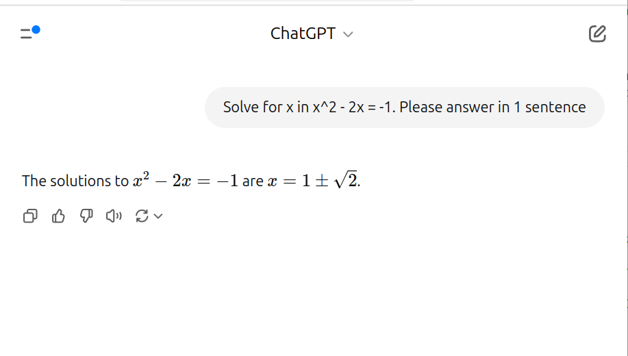
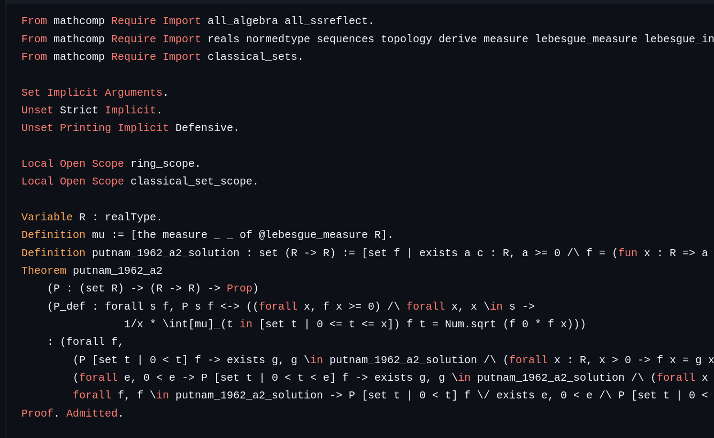
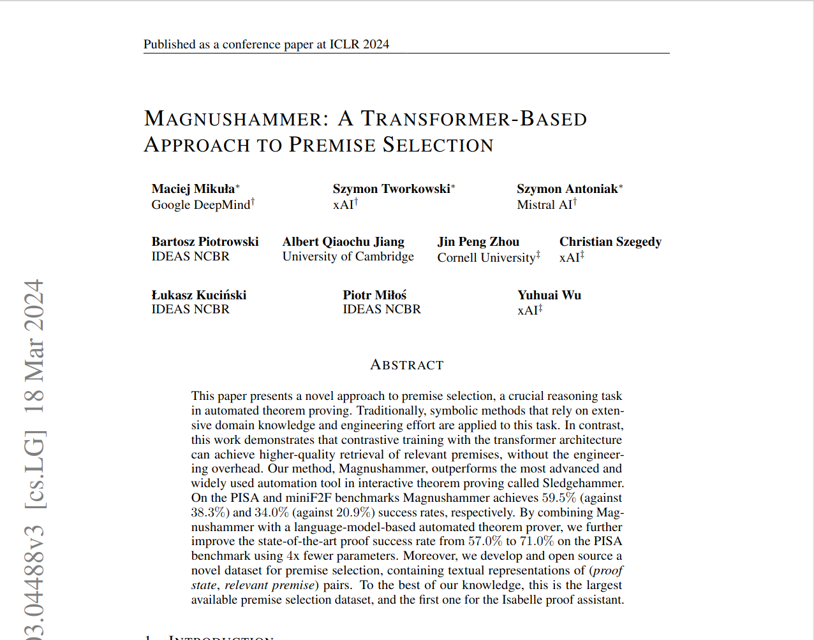

---
title:
- AI for Mathematics (AI4Math)
author:
- Paweł Balawender
date:
- Thursday, May 22, 2025
# pandoc -t beamer core.md -o core.pdf --bibliography references.bib --citeproc  -M link-citations=true -V colortheme:crane -V theme:CambridgeUS --csl apa.csl
---
# How can AI be used to reason about mathematics?
>- You can prompt an LLM in natural language
>- But verifying the answer by a human is slow and error-prone!
>- Mistakes in informal proofs are hard to spot
>- What if computers could verify reasoning?
>- **Takeaway 1**: we have ways to define abstract math concepts on a computer
>- **Takeaway 2**: language models can generate detailed reasoning
<!-- # 
 -->

# How type systems come to help: C
>- In the below example, the compiler can verify a simple reasoning
>- Calling a function `int -> int` with an `int` argument results with an `int`
```c
int square(int x) { return x * x; }

int sq_of_4 = square(4);
```

# How type systems come to help: C++
>- We like it when the type system is expressible, because we can offload
    checking a number of edge-cases to the compiler
```cpp
std::option<PESEL> getPesel(Person& person);
auto pesel = getPesel(randomPerson);

// this fails - not everyone has PESEL assigned
print(pesel);
// this is ok
if (pesel) { print(pesel.value); }
```

# How type systems come to help: Haskell
>- Haskell allows us to define **inductive** types
```haskell
data Tree valT = Leaf valT | Node (Tree valT) (Tree valT)

size :: Tree valT -> Int
size (Leaf _) = 1
size (Node left right) = size left + size right
```

# How type systems come to help: Rocq
>- Rocq allows us to define **dependent** types
>- Here, we construct a family of types
>- For every natural number `n`, type of lists of length `n`
```haskell
Inductive vec (valT : Type) : nat -> Type :=
| empty : vec valT 0
| append : forall n, valT -> vec valT n -> vec valT (n + 1)

(* equality type possible to define *)
Theorem lt_le_incl : forall n m, n < m -> n <= m.
```

# How type systems come to help: Lean
>- Lean: same theory as Rocq
>- Lean community more liberal in accepting new axioms
>- Take some type, e.g. set `{0, 1, 2, 3, ...}`
>- And some equivalence relation, e.g. `n -> n mod 2`
>- The set `{0, 1}` of abstraction classes is the quotient
>- Lean4 : allow taking a quotient of any type by any equivalence relation
>- This is called **quotient types**
>- Enabled Lean to have one, standard library for real analysis

# Lean readily models ZFC set theory
```haskell
structure Setoid (type : Type) :=
    (relation : type -> type -> Prop)
    (proofEquivalenceRelation : isEquivalence relation)

-- elements of type `Set type` are equivalence classes
-- this leads to implementation of ZFC set theory
def Set (type : Type) [s : Setoid type] : Type :=
    Quotient s relation
```

# Putnam Bench
>- Benchmark for theorem-proving algorithms
>- Problems from Putnam Mathematical Competition years 1962-2023
>- 657 problems formalized in Lean 4
>- 640 in Isabelle
>- 412 in Rocq
>- 253 problems in algebra
>- 226 in analysis
>- 108 in number theory
>- 10 in probability etc.

# Putnam 1962 A1, informal
>- Given five points in a plane, no three of which lie on a straight line, show that some four of these points form the vertices of a convex quadrilateral.

# Putnam 1962 A2, formal


# DeepSeek-Prover-V2
>- submitted to arXiv on 30 Apr 2025
>- previous SOTA on Putnam Bench: Kimina-Prover-7B-Disill
>- 10 problems out of 657 (Lean)
>- DeepSeek-Prover-V2-671B claims: 49
>- problems involved; some proofs "cheat"

# How DeepSeek prover works
>- Prompt general-purpose LLM for natural language proof sketch
>- Here: DeepSeek-V3, Chain of Thought mode
>- Also with DeepSeek-V3, translate subgoals to Lean 4 unproved theorems
>- Smaller 7B prover model to complete Lean proofs of subgoals
>- Use reinforcement learning to train 7B prover
>- Binary reward: proof finished / unfinished.
>- This requires Rocq / Lean to check the proof
>- RL algorithm: Group Relative Policy Optimization (GRPO): not in scope

# AI4Math research in Warsaw: Magnushammer
